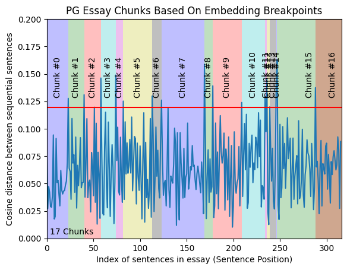

# JChunk

JChunk project is simple library that enables different types of text splitting strategies.
This project begun thanks to Greg Kamradt's post [text splitting ideas](https://github.com/FullStackRetrieval-com/RetrievalTutorials/blob/main/tutorials/LevelsOfTextSplitting/5_Levels_Of_Text_Splitting.ipynb)

## ⚠️ WARNING - STILL IN DEVELOPMENT ⚠️

For now there is only [Pablo Sanchidrian](https://github.com/PabloSanchi) developing this project (in free time) so it might take a while to get to a first stable version.

Feel free to contribute!!

## ROAD MAP
- [ ] Character Chunker (NOT STARTED)
- [ ] Recursive Character Text Chunker (NOT STARTED)
- [ ] Document Specific Chunker (NOT STARTED)
- [x] Semantic Chunker (IN DEVELOPMENT)
- [ ] Agentic Chunker (NOT STARTED)


## Character Chunker

## Recursive Character Text Chunker

## Document Specific Chunker

## Semantic Chunker
When performing retrieval-augmented generation (RAG), fixed chunk sizes can sometimes be inadequate,
either missing crucial information or adding extraneous content. To address this, we can use embeddings to represent the semantic meaning of text, allowing us to chunk content based on semantic relationships.

### How it works?

1. Sentence Splitting:

Split the entire text into sentences using delimiters like '.', '?', and '!' (alternative strategies can also be used).

2. Mapping Sentences:

Transform the list of sentences into the following structure: 
```json
[
  { 
    "sentence": "this is the sentence.",
    "index": 0
  },
  {
    "sentence": "this is the next sentence.",
    "index": 1
  },
  {
    "sentence": "this is the last sentence.",
    "index": 2
  }
]
```

3. Combining Sentences:

Combine each sentence with its preceding and succeeding sentences (the number of sentences will be given by a bufferSize variable ) to reduce noise and better capture relationships. Add a key `combined` for this combined text.

Example for buffer size 1: 
```json
[
  { 
    "sentence": "this is the sentence.",
    "combined": "this is the sentence. this is the next sentence.",
    "index": 0
  },
  {
    "sentence": "this is the next sentence.",
    "combined": "this is the sentence. this is the next sentence. this is the last sentence.",
    "index": 1
  },
  {
    "sentence": "this is the last sentence.",
    "combined": "this is the next sentence. this is the last sentence.",
    "index": 2
  }
]
```

4. Generating Embeddings:

Compute the embedding of each `combined`.

```json
[
  { 
    "sentence": "this is the sentence.",
    "combined": "this is the sentence. this is the next sentence.",
    "embedding": [0.002, 0.003, 0.004, ...], // embedding of the combined key text
    "index": 0
  },
  // ...
]
```

5. Calculating Distances:

Compute the cosine distances between sequential pairs.

6. Identifying Breakpoints:

Analyze the distances to identify sections where distances are smaller (indicating related content) and areas with larger distances (indicating less related content).

7. Determining Split Points:

Use the 95th percentile of the distances as the threshold for determining breakpoints (can use any other percentile or threshold technique).


   
8. Splitting Chunks:

Split the text into chunks at the identified breakpoints.

9. Done!


## Agentic Chunker


